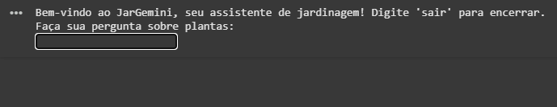
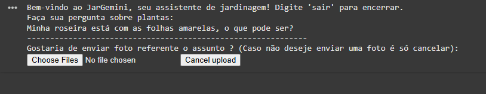
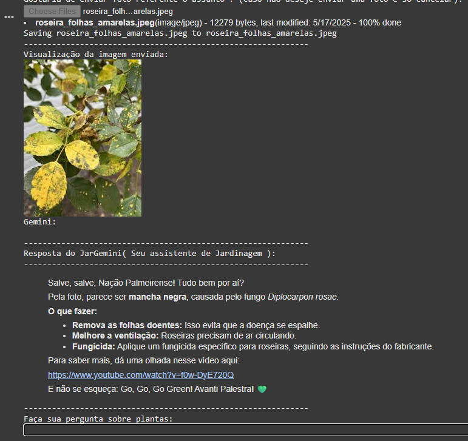
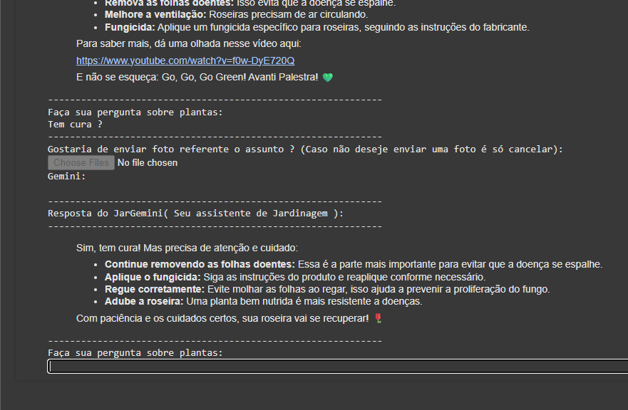

# 🪴 JarGemini: Seu Assistente de Jardinagem Inteligente
## JarGemini é seu assistente de Jardinagem, feito com carinho e Gemini !!! Este projeto é fruto da Imersão IA Alura + Google Gemini

[](https://colab.research.google.com/github/rodrigogodinho/jargemini/blob/main/jargemini.ipynb)

**Descubra o poder da inteligência artificial para cuidar das suas plantas com o JarGemini!** 🤖🌿

Este Colab foi desenvolvido para ser o seu assistente pessoal de jardinagem, oferecendo suporte e informações valiosas sobre plantas frutíferas e ornamentais. Com uma interface de chat intuitiva, você pode fazer perguntas e até mesmo enviar fotos das suas plantas para obter diagnósticos e dicas personalizadas. E sim, ele tem um toque especial de um grande palmeirense! 😉💚

## ✨ Funcionalidades Principais

* **Chat Interativo:** Faça perguntas sobre suas plantas diretamente no Colab e receba respostas úteis e práticas.
* **Diagnóstico por Imagem:** Envie fotos das suas plantas para ajudar o JarGemini a identificar problemas e sugerir soluções.
* **Informações Detalhadas:** Obtenha dados técnicos sobre espécies de plantas com uma linguagem simples e acessível.
* **Links Úteis:** Receba links para vídeos, fotos e outras fontes de informação para complementar as respostas.
* **Histórico de Conversa:** O histórico do chat é mantido para dar contexto a perguntas futuras (o histórico é mantindo até o usuário sair do chat com a palavra "sair").
* **Personalidade Única:** Interaja com um assistente amigável, especialista em jardinagem e com um coração verde e branco! 🇧🇷

## 🚀 Como Utilizar

1.  **Abra no Google Colab:** Clique no badge acima [](https://colab.research.google.com/github/rodrigogodinho/jargemini/blob/main/jargemini.ipynb) para abrir o notebook diretamente no seu navegador.

2.  **Instale as Dependências:** A primeira célula do Colab irá instalar a biblioteca `google-genai`. Execute essa célula pressionando `Shift + Enter` ou clicando no botão de "play" ao lado da célula.

    ```python
    # Instalar o google-genai
    %pip -q install google-genai
    ```

3.  **Importe as Bibliotecas:** A célula seguinte importa todas as bibliotecas necessárias para o funcionamento do assistente. Execute-a da mesma forma.

    ```python
    # Importar as dependências
    import os
    from google.colab import userdata
    from google import genai
    from google.genai import types
    from google.colab import files # para poder selecionar arquivos de sua máquina e enviar para o colab
    from IPython.display import display, HTML, Markdown, Image # Para exibir texto formatado no Colab
    import textwrap # Para formatar melhor a saída de texto
    ```

4.  **Configure sua API Key:** Para que o JarGemini funcione, você precisará da sua `GOOGLE_API_KEY`. O Colab utiliza o `userdata` para armazenar essa informação de forma segura.

    * No menu lateral do Colab, procure pelo ícone de chave (`Secrets`).
    * Clique em "+ Add a secret".
    * No campo "Name", digite `GOOGLE_API_KEY`.
    * No campo "Value", cole a sua chave de API do Google Cloud AI Platform.
    * Clique em "Save".

    Em seguida, execute a célula no Colab que configura a variável de ambiente:

    ```python
    # Criar variável de ambiente com sua GOOGLE_API_KEY
    os.environ["GOOGLE_API_KEY"] = userdata.get('GOOGLE_API_KEY')
    ```

    **Importante:** Mantenha sua chave de API em segredo! Não a compartilhe publicamente.

5.  **Execute o Chat:** A última célula contém o código para iniciar o assistente. Execute esta célula para começar a conversar com o JarGemini.

    ```python
    # Executando a função do chat assistente de jardimagem
    if __name__ == "__main__":
        print("Bem-vindo ao JarGemini, seu assistente de jardinagem! Digite 'sair' para encerrar.")
        chat()
    ```

6.  **Interaja com o JarGemini:** No console de saída, você será solicitado a fazer sua pergunta sobre plantas. Digite sua pergunta e pressione `Enter`.

    ```
    Faça sua pergunta sobre plantas:
    ```

7.  **Envie Fotos (Opcional):** Após fazer sua pergunta, o JarGemini perguntará se você gostaria de enviar uma foto. Se desejar, clique em "Escolher arquivos" e selecione a imagem da sua planta. A imagem será exibida no Colab para sua visualização.

    ```
    -------------------------------------------------------------
    Gostaria de enviar foto referente o assunto ? (Caso não deseje enviar uma foto é só cancelar):
    Escolher arquivos
    ```

8.  **Receba a Resposta:** O JarGemini processará sua pergunta e (se enviada) a foto, e fornecerá uma resposta detalhada e útil. Links relevantes serão incluídos quando apropriado.

    ```
    Gemini: Olá! Para ajudar com sua planta, poderia me dizer qual o problema que você está observando ou qual a sua dúvida? Se tiver uma foto, pode enviar também! E força, Verdão! 💚
    -------------------------------------------------------------
    Resposta do JarGemini( Seu assistente de Jardinagem ):
    -------------------------------------------------------------
    > Olá! Para ajudar com sua planta, poderia me dizer qual o problema que você está observando ou qual a sua dúvida? Se tiver uma foto, pode enviar também! E força, Verdão! 💚
    -------------------------------------------------------------
    ```

9.  **Continue a Conversa:** Você pode continuar fazendo mais perguntas até que todas as suas dúvidas sejam esclarecidas. Para encerrar o chat, digite `sair`.

## 🖼️ Exemplo de Uso Detalhado

Imagine que você notou folhas amareladas em sua roseira e decide pedir ajuda ao JarGemini.



**Usuário:**
```
Minha roseira está com as folhas amarelas, o que pode ser?
```
**JarGemini:**
```

-------------------------------------------------------------
Gostaria de enviar foto referente o assunto ? (Caso não deseje enviar uma foto é só cancelar):
Escolher foto (Você seleciona e envia uma foto da sua roseira com as folhas amarelas)
```

```
-------------------------------------------------------------
Visualização da imagem enviada:
```

```
O JarGemini responderá e mantem o histórico da conversa até que você saia do chat, ou seja,
se perguntar algo como apenas **Tem Cura?**, ele entenderá que é sobre o assunto atual que
estão conversando
-------------------------------------------------------------
```

```
```

## 🛠️ Próximos Passos e Contribuições

Este é um projeto em desenvolvimento e futuras melhorias podem incluir:

* Reconhecimento mais avançado de doenças e pragas através de imagens.
* Sugestões de produtos e tratamentos específicos.
* Integração com calendários de jardinagem e lembretes.
* Suporte para mais modelos de linguagem e funcionalidades do Google AI.

Contribuições são bem-vindas! Se você tiver ideias para melhorar o JarGemini, sinta-se à vontade para abrir uma issue ou enviar um pull request.

## 📜 Licença

MIT License

Copyright (c) [2025] [Rodrigo Godinho]

Permission is hereby granted, free of charge, to any person obtaining a copy
of this software and associated documentation files (the "Software"), to deal
in the Software without restriction, including without limitation the rights
to use, copy, modify, merge, publish, distribute, sublicense, and/or sell
copies of the Software, and to permit persons to whom the Software is
furnished to do so, subject to the following conditions:

The above copyright notice and this permission notice shall be included in all
copies or substantial portions of the Software.

THE SOFTWARE IS PROVIDED "AS IS", WITHOUT WARRANTY OF ANY KIND, EXPRESS OR
IMPLIED, INCLUDING BUT NOT LIMITED TO THE WARRANTIES OF MERCHANTABILITY,
FITNESS FOR A PARTICULAR PURPOSE AND NONINFRINGEMENT. IN NO EVENT SHALL THE
AUTHORS OR COPYRIGHT HOLDERS BE LIABLE FOR ANY CLAIM, DAMAGES OR OTHER
LIABILITY, WHETHER IN AN ACTION OF CONTRACT, TORT OR OTHERWISE, ARISING FROM,
OUT OF OR IN CONNECTION WITH THE SOFTWARE OR THE USE OR OTHER DEALINGS IN THE
SOFTWARE.

## 🙏 Agradecimentos

Agradecemos a todos os entusiastas da jardinagem e aos membros da comunidade Palmeirense pelo apoio e inspiração! 💚

---

**Feito com carinho e inteligência artificial para os amantes de plantas!** 🌿🤖
